# Startup Judge Agentic System

Startup Judge is a portfolio project that shows how to build a small but realistic agentic workflow with LangGraph.

It takes one startup idea and runs it through a sequence of specialized agents: market framing, live web research, risk analysis, business analysis, implementation planning, and a final judge. The final verdict is deterministic: the LLM proposes a score, and the application maps that score to `GO`, `MAYBE`, or `NO-GO`.

## Why this project matters

This project demonstrates more than a single prompt wrapped in an API. It shows how to split a business evaluation into clear agent responsibilities, pass typed state between nodes, add tool use where it belongs, stream progress to the user, and keep final decisions predictable.

The goal is to keep the system understandable while still showing production-shaped patterns: validation, routing, tests, API boundaries, and a clean demo interface.

## Architecture

```mermaid
flowchart LR
    user(["Startup idea"]) --> cli["CLI<br/>Rich stream"]
    user --> web["Dark web UI"]
    web --> api["FastAPI<br/>POST /evaluate"]
    cli --> workflow["LangGraph<br/>StateGraph"]
    api --> workflow

    workflow --> state[("StartupState")]
    state --> market["Market Agent<br/>customers + alternatives"]
    market --> research["Research Agent<br/>Tavily web context"]
    research -. "search tool" .-> tavily[("Tavily")]
    tavily -. "sources" .-> research
    research --> risk["Risk Agent<br/>adoption + execution risks"]
    risk --> business["Business Agent<br/>monetization + MVP assumptions"]
    business --> implementation["Implementation Agent<br/>scope + stack + cost level"]
    implementation --> judge["Judge Agent<br/>score + recommendation"]

    judge --> decision{"Verdict"}
    decision -->|"GO / MAYBE"| result["Final response"]
    decision -->|"NO-GO + retries left"| improve["Improve Agent<br/>refine idea"]
    improve --> market
    result --> web
    result --> cli

    classDef entry fill:#12263a,stroke:#24d3ee,color:#eef6ff,stroke-width:2px;
    classDef agent fill:#101722,stroke:#6ef3ff,color:#eef6ff,stroke-width:1.5px;
    classDef tool fill:#261b3f,stroke:#f4c95d,color:#fff7d6,stroke-width:1.5px;
    classDef decisionStyle fill:#2a1f16,stroke:#f4c95d,color:#fff7d6,stroke-width:2px;
    classDef stateStyle fill:#14291f,stroke:#54e39a,color:#edfff5,stroke-width:2px;

    class user,cli,web,api,workflow,result entry;
    class market,research,risk,business,implementation,judge,improve agent;
    class tavily tool;
    class decision decisionStyle;
    class state stateStyle;
```



If the Judge returns `NO-GO`, the graph can route to Improve and retry the evaluation with a refined idea. The loop is capped at three improvement attempts.

## What it demonstrates

- LangGraph `StateGraph` orchestration
- typed shared state with `StartupState`
- specialized agents with small responsibilities
- Tavily web research as a real external tool
- structured Judge output with Pydantic validation
- deterministic verdict mapping from score
- conditional routing and bounded improvement loops
- streamed CLI updates with Rich terminal output
- FastAPI backend with `POST /evaluate`
- dark frontend interface with inspectable agent outputs
- mocked LLM and tool tests

## Agents

| Agent | Role | Produces |
| --- | --- | --- |
| Market | Frames the customer, problem, alternatives, and assumptions | `market_analysis` |
| Research | Searches the web for current context and sources | `research_findings`, `research_sources` |
| Risk | Reviews adoption, competition, execution, platform, and privacy risks | `risk_analysis` |
| Business | Evaluates monetization, costs, channels, and MVP assumptions | `business_analysis` |
| Implementation | Proposes MVP scope, stack, build steps, risks, and rough cost level | `implementation_plan` |
| Judge | Synthesizes all outputs into a score, verdict, and next step | `final_score`, `verdict`, `recommendation` |
| Improve | Refines weak ideas when the verdict is `NO-GO` | `idea`, `improvement_notes`, `iteration` |

## Demo flow

A good demo input is:

```text
AI assistant for independent barbershops that handles booking, reminders, and no-show reduction
```

The frontend shows the pipeline as the workflow runs. After the result appears, each pipeline step can be opened to inspect that agent's output.

## Setup

```bash
python3 -m venv .venv
source .venv/bin/activate
python -m pip install -r requirements.txt
cp .env.example .env
```

Add your keys to `.env`:

```env
OPENAI_API_KEY=your_openai_api_key_here
OPENAI_MODEL=gpt-4.1-mini
TAVILY_API_KEY=your_tavily_api_key_here
```

## Run

CLI:

```bash
python -m app.main "AI assistant for barbershop scheduling"
```

Web app:

```bash
python -m uvicorn app.api:app --reload
```

Then open:

```text
http://127.0.0.1:8000/
```

API:

```bash
curl -X POST http://127.0.0.1:8000/evaluate \
  -H "Content-Type: application/json" \
  -d '{"idea":"AI assistant for barbershop scheduling"}'
```

Available endpoints:

```text
GET /health
POST /evaluate
```

## CLI stream example

```text
[STREAM] market -> market_analysis
[STREAM] research -> research_findings, research_sources
[STREAM] risk -> risk_analysis
[STREAM] business -> business_analysis
[STREAM] implementation -> implementation_plan
[STREAM] judge -> final_score, verdict, recommendation
[ROUTE] MAYBE -> end

Research Sources
1. Example source title
   https://example.com
```

For a `NO-GO` result with retry attempts left:

```text
[ROUTE] NO-GO at iteration 0/3 -> improve
[STREAM] improve -> idea, improvement_notes, iteration
```

## Tests

```bash
python -m unittest discover -s tests -v
```

The tests mock LLM calls and verify state updates, graph order, streamed update accumulation, API responses, implementation planning, conditional routing, bounded loops, error propagation, research source formatting, and structured Judge validation.

## Related repository

The simpler foundations-only version lives here:

https://github.com/popalexandru/startup-judge-langgraph-basics
